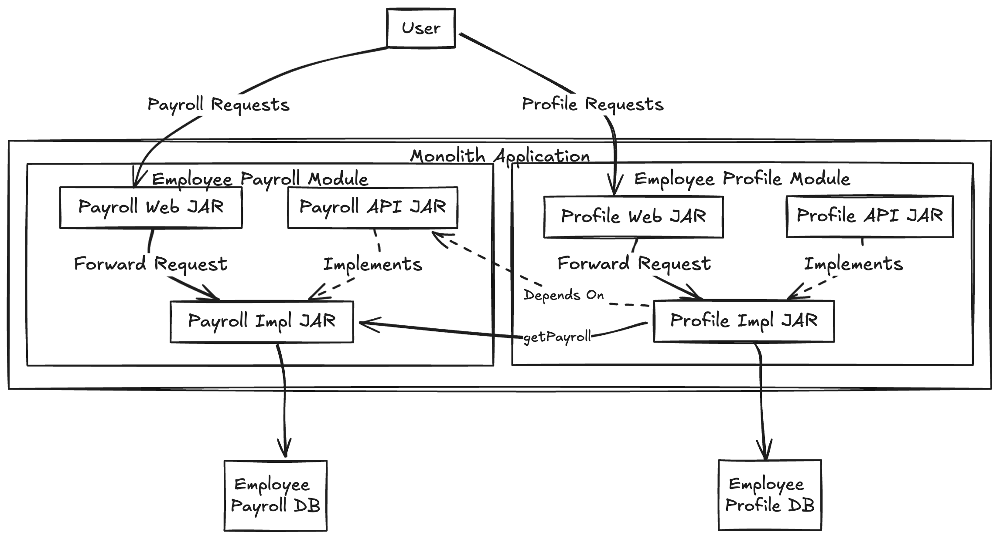
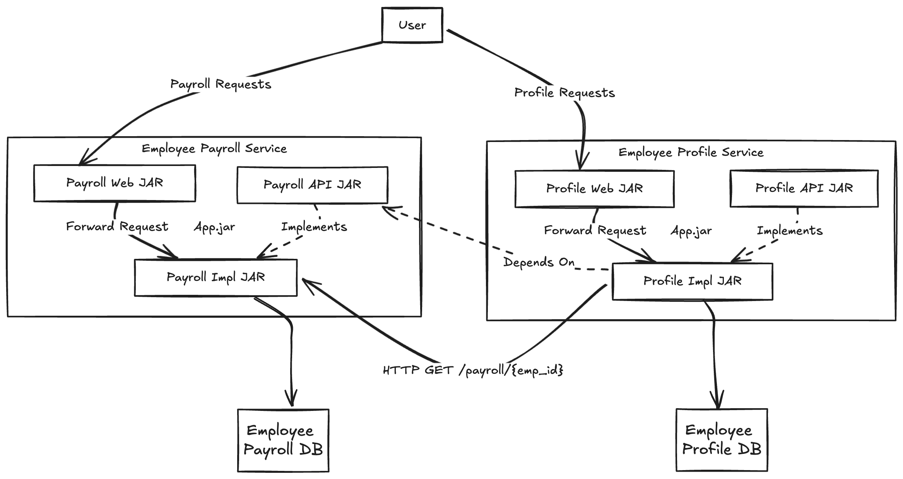

# employee-management

This repository demonstrates a modular monolith architecture using Spring Boot and Java. The architecture is designed to be easily split into microservices by extracting functional modules with minimal effort. It emphasizes loose coupling, dependency injection, and modular design.

## Modules

### Functional Modules

The architecture comprises multiple functional modules and a technical web module. In this example, we have two functional modules:

* employee-profile
* employee-payroll

More such modules can be added based on similar specifications.

Each module consists of two layers:

* API Layer: Defines the module's public interface.
* Implementation Layer: Implements the module's functionality.

Both layers are packaged as independent libraries, distributed as JAR files.

#### API Layer

This is an independent jar, which will contain interfaces that expose business functions related to the respective module.
This jar will always be packed in the app container and should not contain any kind of implementation as it is an abstraction
layer, providing necessary decoupling between the web and implementation layer.

#### Implementation Layer
The implementation layer includes
* implementation of the API specification (interface) provided in api layer.
* code for interaction with database (repository layer, entity classes)
* code for remote clients for external services or messaging queues, DTOs etc.

### Technical Modules

These modules have concerns agnostic to business functionalities, such as web apis, message listeners etc. In this particular
example, a web module is added.

#### Web Module

This module has resources specific to REST api exposure (OpenAPI spec, Controller code) to external applications.
This module will have dependency on functional modules and will be agnostic to any implementation.

## Deployment Modes

The key feature of this architecture style is the capability to deploy this application in a monolith as well as a collection of
microservices based on configuration.

How do we achieve that?

As described above, each module is a cohesive unit , comprising a service layer with business logic, a repository layer and models.
Each of these modules are packaged in a jar, each module having a separate and independent database schema, which can only be accessed by the respective module.

### Monolith Mode

In this mode, all the module jars are packaged within a single Jar and the whole application runs in a single runtime. The interaction between
the modules is just a java method call, by injecting the dependency of corresponding module's api interface. These calls can also use JTA or Spring transactions
in these calls to support transactional nature if required.

#### Architecture

### Microservice Mode

Each module has a capability to be deployed as an independent runtime. These modules can expose a REST layer for external applications, hiding all the module
services and repository behind it, acting like a typical n-tier applications.

#### Architecture

## Moving from Monolith to Microservice Mode

If any application is developed as a monolith following this architectural approach, it can be easily split into microservices following some configuration changes
and some little adjustments.

### Steps

* 

